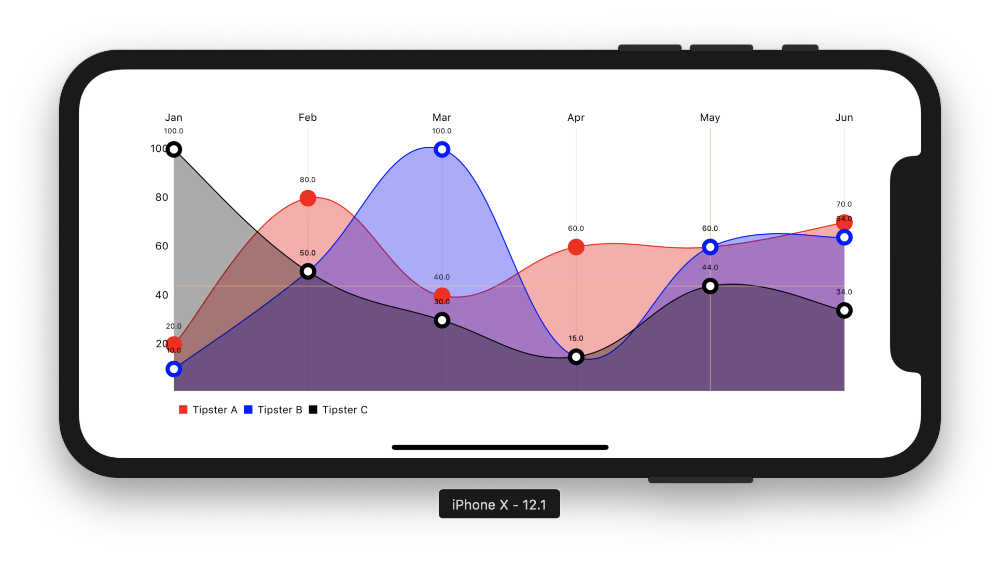

# Basic Charts example

Two of the most charts used in this example. 

## Description

First Chart using LineaChartView.

Second Chart using CombinedChartView.

Both of them share a formater for transform double values (1.0, 2.0...) to Strings, in this case the months.

### Install

To be able to install you need to first install cocopads and update to the latest version if possible.
`Charts` requires CocoaPods version `>= 1.5.0`

Once you have it installed, just use `$Pod install `.

### More info

For more info visit  `https://github.com/danielgindi/Charts`
